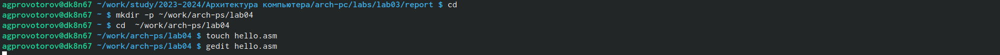
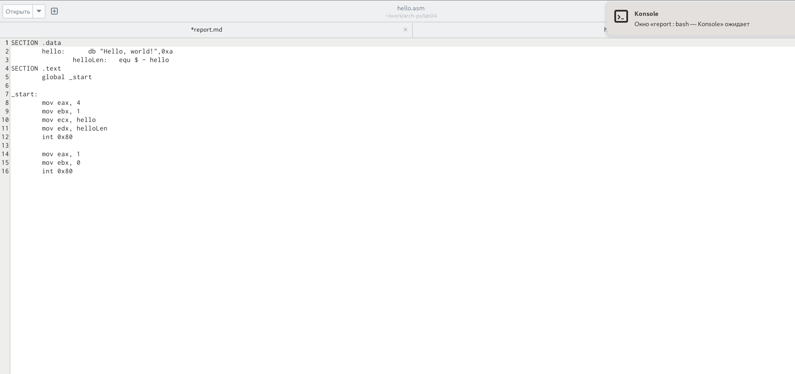
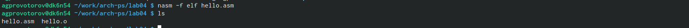
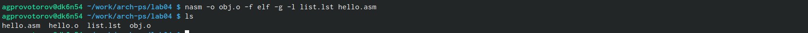
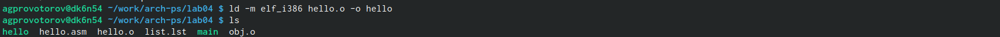

---
## Front matter
title: "Отчет по лабораторной работе №4"
author: "Провоторов АНтон Григорьевич"

## Generic otions
lang: ru-RU
toc-title: "Содержание"

## Bibliography
bibliography: bib/cite.bib
csl: pandoc/csl/gost-r-7-0-5-2008-numeric.csl

## Pdf output format
toc: true # Table of contents
toc-depth: 2
lof: true # List of figures
lot: true # List of tables
fontsize: 12pt
linestretch: 1.5
papersize: a4
documentclass: scrreprt
## I18n polyglossia
polyglossia-lang:
  name: russian
  options:
	- spelling=modern
	- babelshorthands=true
polyglossia-otherlangs:
  name: english
## I18n babel
babel-lang: russian
babel-otherlangs: english
## Fonts
mainfont: PT Serif
romanfont: PT Serif
sansfont: PT Sans
monofont: PT Mono
mainfontoptions: Ligatures=TeX
romanfontoptions: Ligatures=TeX
sansfontoptions: Ligatures=TeX,Scale=MatchLowercase
monofontoptions: Scale=MatchLowercase,Scale=0.9
## Biblatex
biblatex: true
biblio-style: "gost-numeric"
biblatexoptions:
  - parentracker=true
  - backend=biber
  - hyperref=auto
  - language=auto
  - autolang=other*
  - citestyle=gost-numeric
## Pandoc-crossref LaTeX customization
figureTitle: "Рис."
tableTitle: "Таблица"
listingTitle: "Листинг"
lofTitle: "Список иллюстраций"
lotTitle: "Список таблиц"
lolTitle: "Листинги"
## Misc options
indent: true
header-includes:
  - \usepackage{indentfirst}
  - \usepackage{float} # keep figures where there are in the text
  - \floatplacement{figure}{H} # keep figures where there are in the text
---

# Цель работы

Освоение процедуры компиляции и сборки программ, написанных на ассемблере NASM

# Выполнение лабораторной работы

{#fig:001 width=70%}

{#fig:001 width=70%}

{#fig:001 width=70%}

{#fig:001 width=70%}

{#fig:001 width=70%}

{#fig:001 width=70%}

{#fig:001 width=70%}

## Выполнение заданий для самостоятельной работы.

С помощью утилиты cp создаю в текущем каталоге копию файла hello.asm с именем lab5.asm (рис. [-@fig:010]).

{ #fig:010 width=70% }

С помощью текстового редактора mousepad открываю файл lab4.asm и вношу изменения в программу так, чтобы она выводила мои имя и фамилию. (рис. [-@fig:011]).

{ #fig:011 width=70% }

Компилирую текст программы в объектный файл (рис. [-@fig:012]). Проверяю с помощью утилиты ls, что файл lab5.o создан.

{ #fig:012 width=70% }

Передаю объектный файл lab4.o на обработку компоновщику LD, чтобы получить исполняемый файл lab5 (рис. [-@fig:013]).

{ #fig:013 width=70% }

Запускаю исполняемый файл lab4, на экран действительно выводятся мои имя и фамилия (рис. [-@fig:014]).

{ #fig:014 width=70% }

{ #fig:015 width=70% }

Удаляю лишние файлы в текущем каталоге с помощью утилиты rm, ведь копии файлов остались в другой директории (рис. [-@fig:016]).

{ #fig:016 width=70% }

С помощью команд git add . и git commit добавляю файлы на GitHub, комментируя действие как добавление файлов для лабораторной работы №5 (рис. [-@fig:017]).

{ #fig:017 width=70% }

Отправляю файлы на сервер с помощью команды git push (рис. [-@fig:018]).

{ #fig:018 width=70% }

# Выводы

При выполнении данной лабораторной работы я освоил процедуры компиляции и сборки программ, написанных на ассемблере NASM.

