---
## Front matter
title: "Отчет по лабораторной работе №8"
subtitle: "Дисциплина: архитектура компьютера"
author: "Провоторов Антон Григорьевич"

## Generic otions
lang: ru-RU
toc-title: "Содержание"

## Bibliography
bibliography: bib/cite.bib
csl: pandoc/csl/gost-r-7-0-5-2008-numeric.csl

## Pdf output format
toc: true # Table of contents
toc-depth: 2
lof: true # List of figures
fontsize: 12pt
linestretch: 1.5
papersize: a4
documentclass: scrreprt
## I18n polyglossia
polyglossia-lang:
  name: russian
  options:
	- spelling=modern
	- babelshorthands=true
polyglossia-otherlangs:
  name: english
## I18n babel
babel-lang: russian
babel-otherlangs: english
## Fonts
mainfont: PT Serif
romanfont: PT Serif
sansfont: PT Sans
monofont: PT Mono
mainfontoptions: Ligatures=TeX
romanfontoptions: Ligatures=TeX
sansfontoptions: Ligatures=TeX,Scale=MatchLowercase
monofontoptions: Scale=MatchLowercase,Scale=0.9
## Biblatex
biblatex: true
biblio-style: "gost-numeric"
biblatexoptions:
  - parentracker=true
  - backend=biber
  - hyperref=auto
  - language=auto
  - autolang=other*
  - citestyle=gost-numeric
## Pandoc-crossref LaTeX customization
figureTitle: "Рис."
listingTitle: "Листинг"
lofTitle: "Список иллюстраций"
lotTitle: "Список таблиц"
lolTitle: "Листинги"
## Misc options
indent: true
header-includes:
  - \usepackage{indentfirst}
  - \usepackage{float} # keep figures where there are in the text
  - \floatplacement{figure}{H} # keep figures where there are in the text
---

# Цель работы

Приобретиние навыков написания рограмм с использованием циклов и обработкой аргументов строки

# Теоретическое введение

Стек — это структура данных, организованная по принципу LIFO («Last In — First Out» или «последним пришёл — первым ушёл»). Стек является частью архитектуры процессора и реализован на аппаратном уровне. Для работы со стеком в процессоре есть специальные регистры (ss, bp, sp) и команды. 
Основной функцией стека является функция сохранения адресов возврата и передачи аргументов при вызове процедур. Кроме того, в нём выделяется память для локальных переменных и могут временно храниться значения регистров.
Стек имеет вершину, адрес последнего добавленного элемента, который хранится в регистре esp (указатель стека). Противоположный конец стека называется дном. Значение, помещённое в стек последним, извлекается первым. При помещении значения в стек указатель стека уменьшается, а при извлечении — увеличивается.

# Задание

Выполнить лабораторную и самостоятельную работу, и написать отчет на основании проделанной работы

# Выполнение лабораторной работы

Создал каталог для программ лабораторной работы №8, переше и создал файл lab8-1.asm (рис. @fig:001).

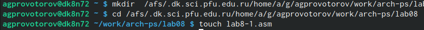{#fig:001 width=70%}

Ввел в файл lab8-1.asm текст программы из листинга 8.1. Создал исполняемый файл
и проверил его работу.(рис. @fig:002).

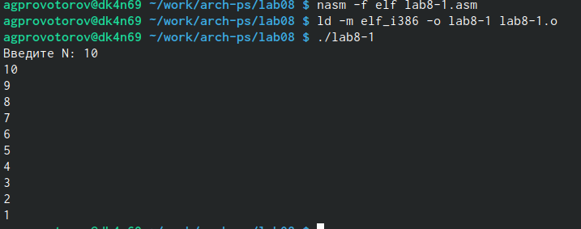{#fig:002 width=70%}

Изменил текст файла lab8-1.asm(рис. @fig:003).

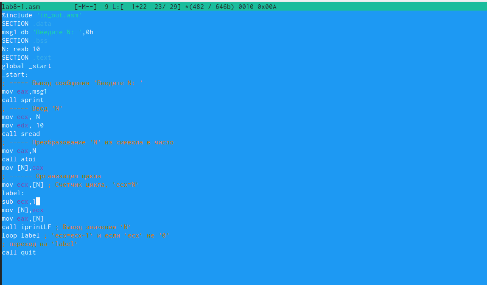{#fig:003 width=70%}

Проверил работу файла после изменение текста файла(рис. @fig:004). 

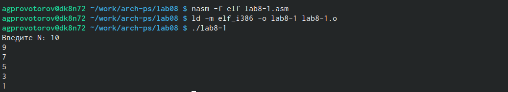{#fig:004 width=70%}

Изменил текст файла lab8-1.asm(рис. @fig:005).

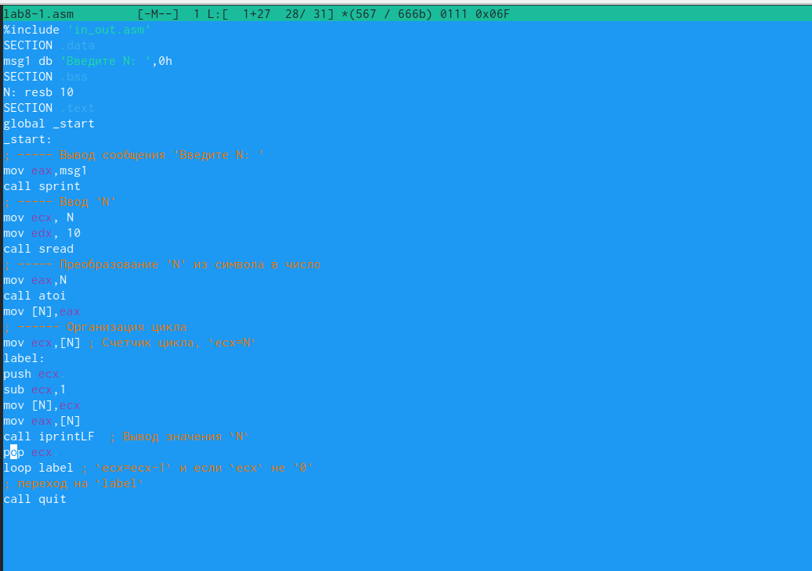{#fig:005 width=70%}

Проверил работу файла после изменение текста файла(рис. @fig:006).

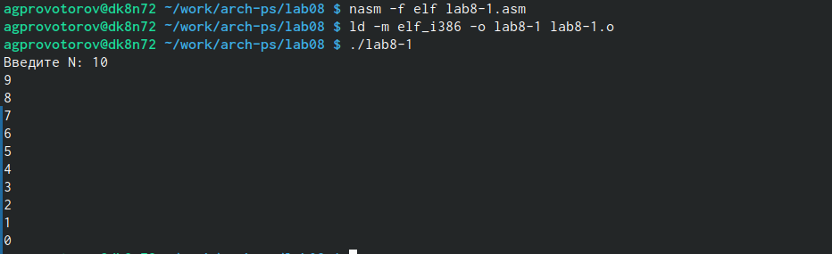{#fig:006 width=70%}

Создал файл lab8-2.asm в каталоге ~/work/arch-pc/lab08 и ввел в него текст про-
граммы из листинга 8.2.(рис. @fig:007).

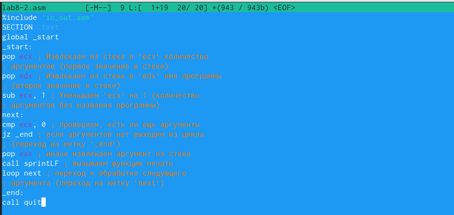{#fig:007 width=70%}

Создал исполняемый файл и запустил его, указав аргументы 10 5 4(рис. @fig:008).

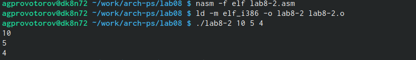{#fig:008 width=70%}

Создал файл lab8-3.asm в каталоге ~/work/arch-
pc/lab08 и ввел в него текст программы из листинга 8.3.(рис. @fig:009).

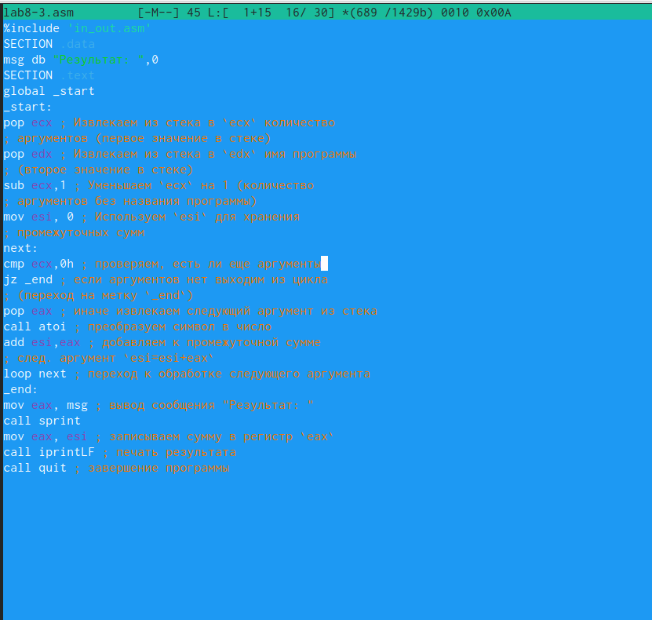{#fig:009 width=70%}

Измененил текст файла lab8-3.asm в соотвествии с заданием(рис. @fig:011).

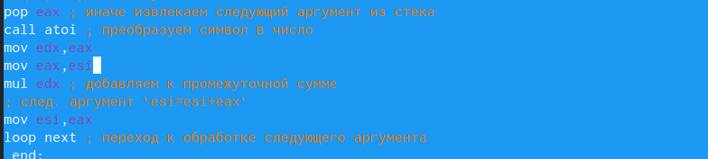{#fig:011 width=70%}

Проверил работу программы.Программа работает корректно(рис. @fig:012).

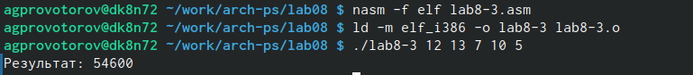{#fig:012 width=70%} 
## Самостоятельная работа
Так как мой вариант 1, написал программу для суммы значений функции f(x)=2x+15 от введённых значений (рис. @fig:015).

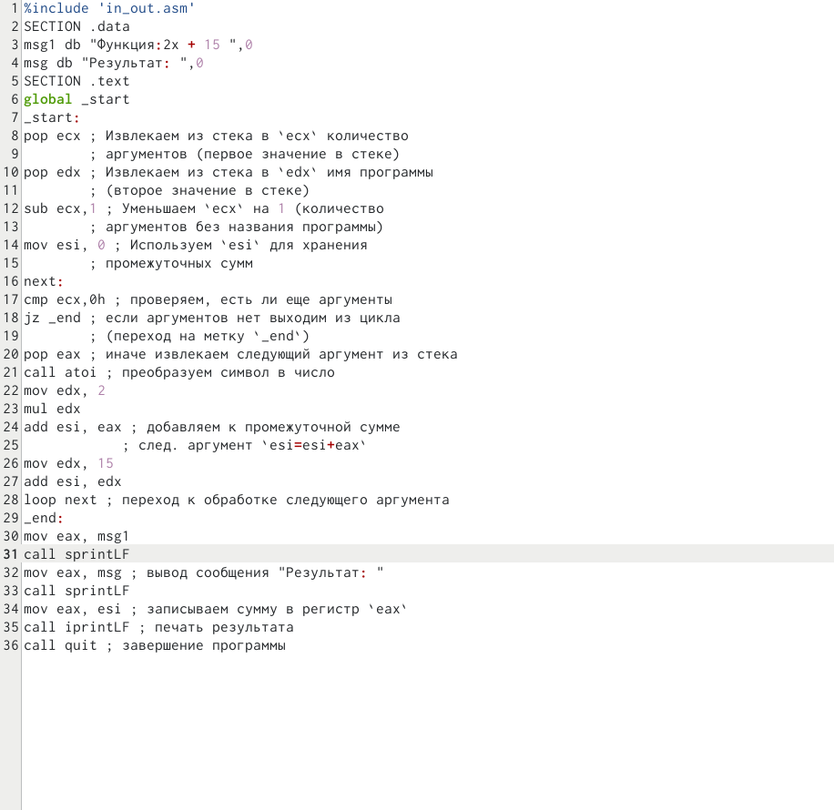{#fig:015 width=70%}

Скомпилировав файл, убедимся, что он работает корректно (рис. @fig:014).

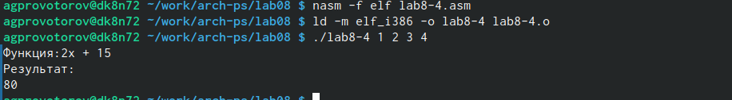{#fig:014 width=70%}

# Выводы

Я научился использовать писать циклы на языке ассемблера, а также получать информацию из командной строки.

# Список литературы

1. GDB: The GNU Project Debugger. — URL: https://www.gnu.org/software/gdb/.
2. GNU Bash Manual. — 2016. — URL: https://www.gnu.org/software/bash/manual/.
3. Midnight Commander Development Center. — 2021. — URL: https://midnightcommander.org/.
4. NASM Assembly Language Tutorials. — 2021. — URL: https://asmtutor.com/.
5. Newham C. Learning the bash Shell: Unix Shell Programming. — O’Reilly Media, 2005. — 354 с. — (In a Nutshell). — ISBN 0596009658. — URL: http://www.amazon.com Learning-bash-Shell-Programming-Nutshell/dp/0596009658.
6. Robbins A. Bash Pocket Reference. — O’Reilly Media, 2016. — 156 с. — ISBN 978-1491941591.
7. The NASM documentation. — 2021. — URL: https://www.nasm.us/docs.php.
8. Zarrelli G. Mastering Bash. — Packt Publishing, 2017. — 502 с. — ISBN 9781784396879.
9. Колдаев В. Д., Лупин С. А. Архитектура ЭВМ. — М. : Форум, 2018.
10. Куляс О. Л., Никитин К. А. Курс программирования на ASSEMBLER. — М. :Солон-Пресс, 2017.
11. Новожилов О. П. Архитектура ЭВМ и систем. — М. : Юрайт, 2016.
12. Расширенный ассемблер: NASM. — 2021. — URL: https://www.opennet.ru/docs/RUS/nasm/.
13. Робачевский А., Немнюгин С., Стесик О. Операционная система UNIX. — 2-е изд. — БХВ- Петербург, 2010. — 656 с. — ISBN 978-5-94157-538-1.
14. Столяров А. Программирование на языке ассемблера NASM для ОС Unix. — 2-е изд. — М. : МАКС Пресс, 2011. — URL: http://www.stolyarov.info/books/asm_unix.
15. Таненбаум Э. Архитектура компьютера. — 6-е изд. — СПб. : Питер, 2013. - 874 с. — (Классика Computer Science).
16. Таненбаум Э., Бос Х. Современные операционные системы. — 4-е изд. -СПб. : Питер,
2015. — 1120 с. — (Классика Computer Science)
